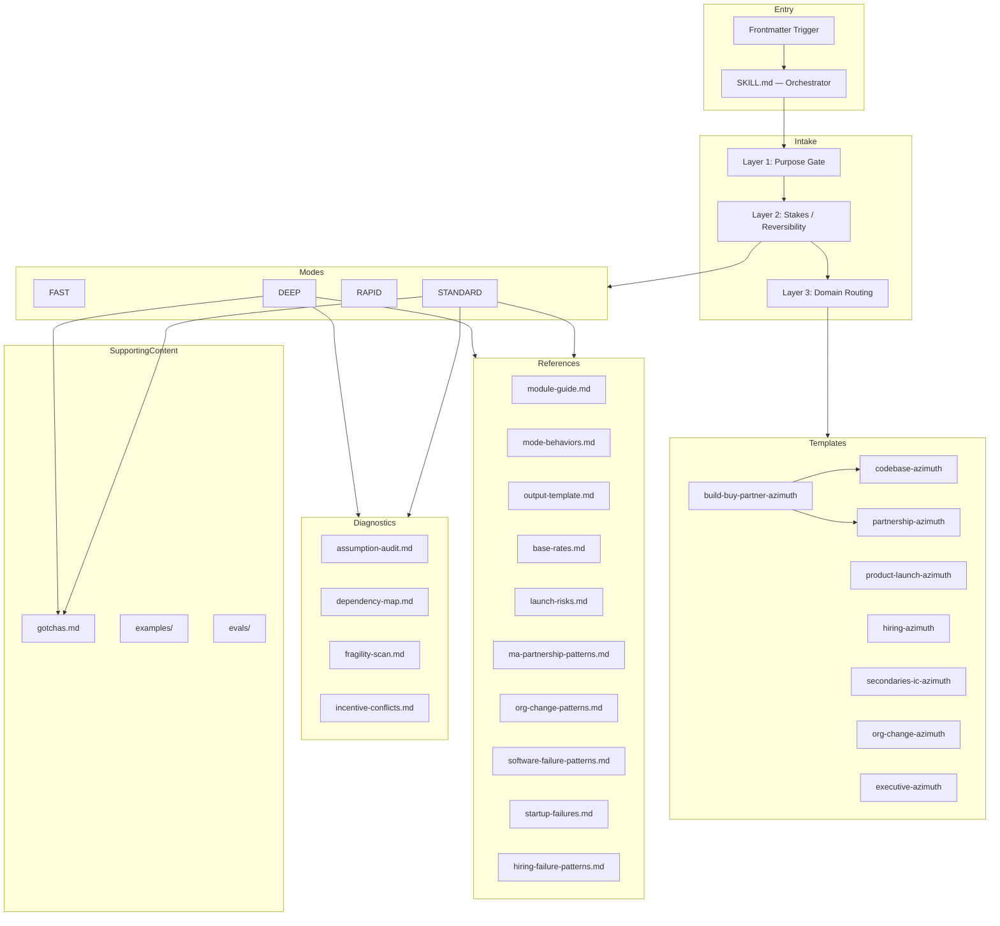
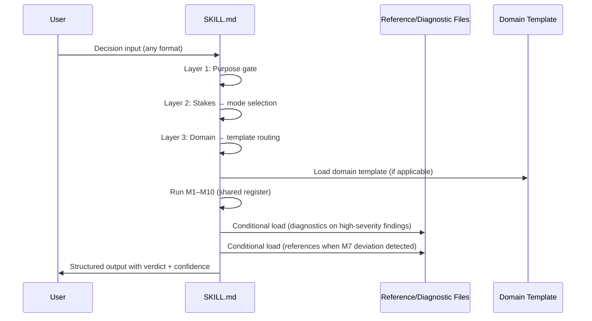

# AZIMUTH Codebase Map

> Auto-generated by Cartographer. Last mapped: 2026-05-18T14:07:42Z

## System Overview

AZIMUTH is a pure-markdown AI agent skill — no build system, no runtime dependencies, no code. It operates entirely through prompt instructions loaded into a Claude conversation. The architecture is a **depth-on-demand system**: `SKILL.md` is a compact 160-line always-loaded orchestrator containing all load-bearing behavioral rules; every other file loads on-demand based on mode, domain, and per-module findings. This design ensures the 5 load-bearing behavioral rules are always reachable regardless of conversation history length.



---

## Directory Structure

```
azimuth/
├── SKILL.md                          # Master orchestrator — always loaded, 160 lines (~1,700 tokens)
├── gotchas.md                        # 8 structural failure patterns — conditional/DEEP load
├── README.md                         # Public docs — not loaded into skill context
├── CHANGELOG.md                      # Full version history — not loaded into skill context
├── ROADMAP.md                        # Planned features — not loaded into skill context
├── index.html                        # GitHub Pages landing page — not loaded into skill context
├── LICENSE                           # MIT
├── .gitignore                        # Excludes .omc/, graphify-out/, research/, MARKETING.md, CLAUDE.md
│
├── references/                       # On-demand data loaded based on mode and module findings
│   ├── module-guide.md               # M1-M10 full bodies, register discipline, escalation logic — loads STANDARD/RAPID/DEEP
│   ├── mode-behaviors.md             # FAST/STANDARD/RAPID/DEEP run specs — loads STANDARD/RAPID/DEEP
│   ├── output-template.md            # Default output format, domain pointers, anti-slop rules — loads all modes
│   ├── base-rates.md                 # Historical failure rates across all domains (3,172 tokens)
│   ├── hiring-failure-patterns.md    # Hiring-specific failure patterns — DEEP hiring domain
│   ├── launch-risks.md               # Pre/during/post launch risk zones (1,273 tokens)
│   ├── ma-partnership-patterns.md    # 8 M&A/partnership failure patterns (1,712 tokens)
│   ├── org-change-patterns.md        # 6 org change failure patterns (1,719 tokens)
│   ├── software-failure-patterns.md  # 10 engineering failure patterns (1,410 tokens)
│   └── startup-failures.md           # 8 startup-specific failure patterns (1,241 tokens)
│
├── diagnostics/                      # Deep-drill frameworks for high-severity module findings
│   ├── assumption-audit.md           # 5-step M2 framework — loads on 3+ unsupported (1,136 tokens)
│   ├── dependency-map.md             # 5-step M5 framework — loads on critical SPOF (1,047 tokens)
│   ├── fragility-scan.md             # 6-indicator M8 scoring — loads on high irreversibility (1,171 tokens)
│   └── incentive-conflicts.md        # 7-category M4 scan — loads on governance-level conflict (1,300 tokens)
│
├── templates/                        # Domain-specific output formats (replace default)
│   ├── build-buy-partner-azimuth.md  # Path selection → chains to codebase or partnership template
│   ├── codebase-azimuth.md           # Refactors, rewrites, migrations
│   ├── executive-azimuth.md          # 1-page leadership briefing (user-triggered, not Layer 3)
│   ├── hiring-azimuth.md             # Key hire, exec appointment, contractor engagement
│   ├── org-change-azimuth.md         # Restructure, consolidation, leadership transitions
│   ├── partnership-azimuth.md        # M&A, JVs, strategic partnerships, significant vendors
│   ├── product-launch-azimuth.md     # Product/feature launch, beta rollout
│   ├── secondaries-ic-azimuth.md     # PE secondaries IC recommendation
│   └── startup-azimuth.md            # Early-stage / pre-PMF startup decisions
│
├── examples/                         # Case studies — documentation only, not loaded
│   ├── case-study-healthcare-gov.md  # DEEP mode run, 5/6 calibration score
│   └── case-study-open-source-launch-timing.md  # STANDARD mode run, solo dev decision
│
└── evals/                            # Eval program — development artifact, not loaded
    ├── README.md
    ├── cases/                        # 6 synthetic test cases gating roadmap changes
    ├── methodology/                  # 3 methodology documents
    ├── rubrics/                      # 3 scoring rubrics
    ├── results/                      # 15 result files (v1.1.0 baseline through v1.2.x)
    └── test-*-control-skill.md       # Prior-version SKILL.md copies used as eval baselines
```

---

## Module Guide

### SKILL.md — Master Orchestrator

**Purpose:** Always-loaded entry point. Contains intake routing, all 5 load-bearing behavioral rules, the 10-module analysis engine (compact), mode selection, 9-verdict taxonomy, and reference loading instructions. Full module bodies, mode run specs, and output format details live in on-demand reference files.

**Hard constraint:** Frontmatter `description` field must be ≤489 characters. Enforced by `npx skills add` installer. The description must include an explicit `Do NOT invoke for…` clause to prevent over-broad automatic invocation. (Prior 669-char description triggered AZIMUTH on routine queries — fixed in v1.1.0.)

**Architectural constraint (RESOLVED in v1.4.0):** Prior to v1.4.0, SKILL.md was 865 lines (~9,333 tokens). Under long-session conditions (conversation history above ~150K–177K tokens), the file truncated at approximately line 225, rendering all 5 load-bearing behavioral rules unreachable. The v1.4.0 redesign compressed SKILL.md to 160 lines (~1,700 tokens), placing all 5 load-bearing behavioral rules at lines 76–86 — well within the always-loaded zone. Module bodies, mode specs, and output templates moved to on-demand reference files (`references/module-guide.md`, `references/mode-behaviors.md`, `references/output-template.md`).

**Key files:** `SKILL.md`
**Tokens:** ~1,700

---

### 10-Module Analysis Engine

| Module | Name | Role | Key Bias Hook |
|--------|------|------|---------------|
| M1 | Objective Integrity Check | Gate: pre-commit / post-commit / non-decision | Adversarial reframe check; WRONG TOOL exit |
| M2 | Assumption Audit | Register seeding by category and evidence class | Sycophancy circuit-breaker: most-depended-on assumption is first UNSUPPORTED candidate (**LOAD-BEARING**) |
| M3 | Constraint Reality Check | Dominant constraint identification | Rank constraints, do not list equally |
| M4 | Incentive Scan & Interview | 7-question interview → GREEN/YELLOW/RED tier | PRE-CHECK self-proposal detection (**LOAD-BEARING**) |
| M5 | Dependency Fragility Map | SPOF and concentration risk using M2 register | Use M2 UNSUPPORTED assumptions as SPOF candidates |
| M6 | Failure Path Construction | 3 chains anchored in shared register | Availability inversion: ≥1 chain must not apply to generic plan (**LOAD-BEARING**) |
| M7 | Base Rate Reality Check | Backpropagate historically common failure modes | Domain calibration: adjacent domains directional only (**LABELING-ONLY**) |
| M8 | Detectability & Recovery | Detectability/recovery per existing register entries | Register check: no new risk list generated |
| M9 | Mitigation Design | Mitigations for top risks only; no new register entries | Weak mitigation rejection (**CORROBORATING**) |
| M10 | Decision Verdict | Terminal output with confidence ceiling | Confidence ceiling: UNSUPPORTED top assumption → MEDIUM max (**LOAD-BEARING**) |

Hook classification key: **LOAD-BEARING** = behavior changes qualitatively without hook; **PARTIAL** = partial compensation exists; **CORROBORATING** = fully compensated by training norms; **LABELING-ONLY** = vocabulary only

---

### Intake Routing

**Three-layer system before any module runs:**

- **Layer 1 — Purpose:** Is this a pre-commitment decision, a committed decision (→ RESIDUAL-RISK-REGISTER), or not a decision at all (→ WRONG TOOL / INSUFFICIENT SIGNAL)?
- **Layer 2 — Stakes/Reversibility:** Determines operating mode (FAST / STANDARD / RAPID / DEEP). Phrasing-vs-stakes tiebreaker (v1.3.0): stakes signals always win over user mode selection; override is always visible in output header.
- **Layer 3 — Domain:** Routes to the appropriate template. Bypass Handling skips re-running Module 4 when a CARRY FORWARD block from `build-buy-partner-azimuth.md` is present.

**Special cases:**
- Same-decision re-analysis: differential protocol — only new information is analyzed
- INSUFFICIENT SIGNAL: returned when input is too vague for a valid pre-commitment analysis
- WRONG TOOL: returned when AZIMUTH is invoked outside its use case

---

### Mode Load Matrix

| File | FAST | STANDARD | RAPID | DEEP |
|------|------|----------|-------|------|
| SKILL.md | ✓ always | ✓ always | ✓ always | ✓ always |
| references/output-template.md | ✓ always | ✓ always | ✓ always | ✓ always |
| references/module-guide.md | — | ✓ always | ✓ always | ✓ always |
| references/mode-behaviors.md | — | ✓ always | ✓ always | ✓ always |
| gotchas.md | — | Conditional¹ | — | ✓ (trigger-gated) |
| references/base-rates.md | — | Conditional² | — | ✓ |
| references/software-failure-patterns.md | — | Conditional² | — | Tech/eng domain |
| references/launch-risks.md | — | Conditional² | — | Product/launch domain |
| references/startup-failures.md | — | Conditional² | — | Startup/venture domain |
| references/ma-partnership-patterns.md | — | Conditional² | — | M&A/partnerships domain |
| references/org-change-patterns.md | — | Conditional² | — | Org change domain |
| references/hiring-failure-patterns.md | — | Conditional² | — | Hiring domain |
| diagnostics/assumption-audit.md | — | Conditional³ | — | ✓ always |
| diagnostics/incentive-conflicts.md | — | Conditional⁴ | — | ✓ always |
| diagnostics/dependency-map.md | — | Conditional⁵ | — | ✓ always |
| diagnostics/fragility-scan.md | — | Conditional⁶ | — | ✓ always |
| Domain template | — | Per Layer 3 | Per Layer 3 | Per Layer 3 |

¹ M4 RED tier or M6 availability-inversion trigger  
² M7: plan in covered category + user estimates deviate from historical ranges; or DEEP mode matching domain  
³ M2: 3+ unsupported assumptions or any contradicted assumption  
⁴ M4: governance-level incentive conflict surfaced  
⁵ M5: critical SPOF or concentration risk identified  
⁶ M8: high irreversibility + late detectability  

---

### Template Routing (Layer 3)

| Domain | Template |
|--------|----------|
| Technology / engineering / infrastructure | `templates/codebase-azimuth.md` |
| Product launch or feature rollout | `templates/product-launch-azimuth.md` |
| Hiring, contractor, or key role | `templates/hiring-azimuth.md` |
| Partnership, M&A, or significant vendor | `templates/partnership-azimuth.md` |
| PE secondaries / investment committee | `templates/secondaries-ic-azimuth.md` |
| Organizational restructure / change management | `templates/org-change-azimuth.md` |
| Build vs. buy vs. partner | `templates/build-buy-partner-azimuth.md` → chains to codebase or partnership |
| Startup / early-stage / pre-PMF | `templates/startup-azimuth.md` |
| Other / general | Default template (`references/output-template.md`) |
| Executive briefing | `templates/executive-azimuth.md` (user-triggered, not Layer 3 routing) |

**Template chaining:** `build-buy-partner-azimuth.md` is the only template that chains to another. After path selection it emits a CARRY FORWARD block; the next session loads the domain template with Module 4 interview skipped if prior tier was GREEN.

---

### Verdict Taxonomy (9 verdicts + 1 domain extension)

**Action verdicts** (pre-commitment go/no-go):
- PROCEED
- PROCEED WITH SAFEGUARDS
- PILOT FIRST
- REDUCE SCOPE
- DELAY PENDING EVIDENCE
- REJECT

**Refusal verdicts** (input is not a valid pre-commitment decision):
- INSUFFICIENT SIGNAL
- WRONG TOOL

**Alternative-deliverable verdict** (decision is already closed):
- RESIDUAL-RISK-REGISTER — produces risk register, not go/no-go

**Domain extension** (partnership template only):
- RENEGOTIATE — not part of core 9-verdict taxonomy

---

### references/ — On-Demand Data

Three structural reference files load for all non-FAST modes; domain data files load conditionally based on mode and module findings.

| File | Load condition | Key content |
|------|---------------|-------------|
| module-guide.md | STANDARD/RAPID/DEEP always | M1–M10 full bodies, register discipline, escalation logic, heuristics, workflow extensions |
| mode-behaviors.md | STANDARD/RAPID/DEEP always | FAST/STANDARD/RAPID/DEEP run specs, conditional load triggers, RAPID time-pressure rules |
| output-template.md | All modes always | Default output template (10 sections), domain format pointers, anti-slop rules |
| base-rates.md | Conditional / DEEP always | Historical failure rates across 7 domains; fully sourced (McKinsey/Oxford, Standish CHAOS, CB Insights, BLS, Pendo, Flexera, Kotter) |
| hiring-failure-patterns.md | Conditional / DEEP hiring | Hiring-specific failure patterns |
| launch-risks.md | Conditional / DEEP product | 3 risk zones (pre/during/post launch), 8 risks with signals and mitigations |
| ma-partnership-patterns.md | Conditional / DEEP M&A | 8 patterns with failure signature and AZIMUTH question |
| org-change-patterns.md | Conditional / DEEP org | 6 patterns explicitly distinct from Kotter process failures in base-rates.md |
| software-failure-patterns.md | Conditional / DEEP tech | 10 patterns; distinct from gotchas.md (technical vs. organizational/behavioral) |
| startup-failures.md | Conditional / DEEP startup | 8 patterns from Premature Scaling to Distribution Absent |

**Gotcha:** The legacy "70-80% rewrite failure rate" was retired (traced to Joel Spolsky opinion piece). Replaced with McKinsey/Oxford 56% finding as directional lower bound.

---

### diagnostics/ — Deep-Drill Frameworks

Each diagnostic loads when its corresponding module surfaces a high-severity finding in STANDARD mode; all four load unconditionally in DEEP mode.

| File | Trigger module | Key structure | Notable behavior |
|------|---------------|---------------|-----------------|
| assumption-audit.md | M2 | 5-step: extract → classify → prioritize → validate → gate | Risk Score = Impact × (Reversibility + Verifiability) / 2 |
| dependency-map.md | M5 | 5-step: inventory → assessment matrix → critical path → sequencing → concentration | Approval cycle documented as 2-3x stated estimate |
| fragility-scan.md | M8 | 6 indicators → fragility score (LOW/MEDIUM/HIGH/CRITICAL) | CRITICAL score triggers verdict bias toward DELAY or PILOT |
| incentive-conflicts.md | M4 | 7 categories → GOVERNANCE / EXECUTION / LATENT RISK | GOVERNANCE RISK triggers gotchas.md load in STANDARD mode |

---

### templates/ — Domain Output Formats

Each template replaces the default SKILL.md output format for its domain. All include a domain-specific Incentive Alignment Scan matrix (Module 4 adapted for the domain actor set).

**Notable per-template constraints:**

- **build-buy-partner-azimuth.md:** Only template that chains. Anchoring Assessment detects pre-commitment to a single path before analysis begins. CARRY FORWARD block required in next session prompt.
- **codebase-azimuth.md:** "If no couplings identified: this is likely an audit gap, not a clean codebase." — actively prevents false-clean assessments.
- **executive-azimuth.md:** Loaded by user request, not Layer 3 routing. Conclusions only — cut any risk that would not cause the audience to act differently.
- **hiring-azimuth.md:** "Unstructured interviews have weak predictive validity" — enforces Schmidt & Hunter finding. Verdict taxonomy standardized in v1.2.0.
- **org-change-azimuth.md:** Three pre-commitment gates that can terminate or redirect analysis before any substantive work. Only template with inline cross-reference to a specific reference file (org-change-patterns.md). "Any 'Assumed' handoff is an accountability gap."
- **partnership-azimuth.md:** Adds RENEGOTIATE as domain-specific verdict. Revenue synergies >30% of deal justification flagged as overestimation risk.
- **product-launch-azimuth.md:** 9-gate readiness assessment matrix (any ✗ = launch blocker). "Any 'Unknown' is an information gap, not a safe default."
- **secondaries-ic-azimuth.md:** Two kill gates (Adverse Selection, Process Integrity) before any analysis. PASS-PROCESS is a non-reopening verdict — most rigid verdict gate in the skill. LP reference calls pre-labeled as "structurally compromised." Legal grounding: ADIC v. EMG, C.A. No. 2025-1389-NAC, Del. Ch. December 2025.
- **startup-azimuth.md:** Adapted for early-stage / pre-PMF decisions where base rates, market size, and assumption density differ from established-company contexts.

---

### gotchas.md — 8 Structural Failure Patterns

**Purpose:** Cross-domain organizational/behavioral/temporal failure patterns intentionally distinct from technical patterns in `references/software-failure-patterns.md`.

| # | Pattern | Signal |
|---|---------|--------|
| 1 | Second System Effect | Rewrites accumulate deferred feature wishes |
| 2 | Approval Chains as Infinite Loop | Cycle time universally underestimated |
| 3 | Commitment Escalation | Sunk cost collapses willingness to stop |
| 4 | The Consensus Trap | No single decision-maker in consensus-required governance |
| 5 | The Last-Mile Gap | Final 10% of execution underinvested (rollout, user readiness) |
| 6 | Metric Drift | Success metrics shift before initiative concludes (>90-day projects) |
| 7 | The Plan-Revision Gap | Risk surfacing does not produce plan changes; scope reduction resisted (Roose, Lehman & Veinott 2023, Human Factors, N=68) |
| 8 | Reversibility Underestimation | Decisions that feel reversible often aren't |

**Load conditions:**
- DEEP mode: unconditional load; patterns are lenses but each still trigger-gated
- STANDARD mode: conditional on M4 RED tier / governance-level incentive conflict **OR** M6 availability inversion trigger
- FAST / RAPID: not loaded

**Eval finding (PARTIAL classification):** gotchas.md adds named patterns with specific check questions not compensated by training norms. The Plan-Revision Gap check question ("name one concrete change to the plan that directly addresses the highest-severity finding — if no plan element changed, the analysis produced awareness, not decision quality") is the most operationally distinctive uncompensated contribution.

---

### evals/ — Eval Program

Development artifact — not loaded into skill context.

**Four-layer program structure:**

| Layer | Files | Purpose |
|-------|-------|---------|
| 1 — Change-gate evals | `evals/cases/` (6 files) + v1.1.0-baseline, v1.1.1 results | Binary pass/fail against 6 synthetic test cases; gates roadmap changes |
| 2 — Hook validation | `evals/results/2026-05-07-v1.2.0-*` | Production-vs-control paired comparison for bias externalization hooks |
| 3 — Coverage testing | `evals/results/2026-05-07-coverage-*` | Extends hook validation to module-body instructions; 6 sessions across 2 tiers |
| 4 — Partial-load characterization | `evals/results/2026-05-07-partial-load-*` | 3-phase investigation into SKILL.md truncation behavior under long sessions |

**Eval methodology:** Production-vs-control paired comparison. Two agents run in parallel — one reads full SKILL.md, one reads a control copy with the target hook redacted. Outputs compared for behavioral delta. Classification assigned (LOAD-BEARING / PARTIAL / CORROBORATING / LABELING-ONLY / UNCLASSIFIED).

**Rubrics** (`evals/rubrics/`): `invocation.md` (binary gate: correct mode, correct INSUFFICIENT SIGNAL behavior), `structural.md` (12-check rubric; pass threshold 9/12), `recall.md` (precision/recall against documented case study outcomes — applies to `examples/` only).

---

## Data Flow



---

## Conventions

**Commit format:** `type(scope): description` — types: `feat`, `fix`, `docs`, `refactor`; scopes: `skill`, `gotchas`, `references`, `diagnostics`, `templates`, `meta`

**Release process:** Validate all four pre-commit checks (description 489 chars, gotchas.md 8 sections, no "precommitment" outside CHANGELOG, all referenced paths exist), tag `vMAJOR.MINOR.PATCH`, push tag, `gh release create`, verify install via `npx skills add`.

**Versioning cadence:** v1.0.0 (initial) → v1.1.x (INSUFFICIENT SIGNAL, counterfactual/coupling passes, sourcing rewrite) → v1.2.x (confidence ceiling, PRE-CHECK, org-change/build-buy-partner templates, partial-load characterization) → v1.3.0 (phrasing-vs-stakes tiebreaker, gotchas.md conditional load fix, landing page) → v1.4.0 (depth-on-demand redesign: 160-line SKILL.md, 3 new reference files, partial-load problem resolved)

---

## Gotchas

1. **Partial-load truncation (RESOLVED in v1.4.0):** Prior to v1.4.0, SKILL.md truncated at line 225 under long sessions, making all 5 load-bearing behavioral rules unreachable. The v1.4.0 redesign compressed SKILL.md to 160 lines; all rules are now at lines 76–86. Module bodies moved to `references/module-guide.md`. If SKILL.md ever grows back past ~200 lines through incremental additions, this risk re-emerges — treat line count as a maintained constraint, not a one-time fix.

2. **Frontmatter 489-char limit:** Hard constraint from `npx skills add` installer. Not a soft recommendation. Violation surfaces validation warning at install time.

3. **gotchas.md trigger discipline:** Prior versions had conflicting instructions between gotchas.md header and SKILL.md. Rewritten in v1.3.0. Patterns apply only when specific triggers fire — not whenever the file is visible in context.

4. **WRONG TOOL vs. INSUFFICIENT SIGNAL distinction:** WRONG TOOL = invoked outside use case (routine ops, tactical execution). INSUFFICIENT SIGNAL = valid decision question but input too vague for analysis. These are distinct refusal verdicts with different implied user actions.

5. **RESIDUAL-RISK-REGISTER semantics:** Not a refusal — it is an alternative deliverable. Used when the decision is already committed. Produces a residual risk register, not a go/no-go verdict. Never returned for pre-commitment decisions.

6. **M10 confidence ceiling operative domain:** Ceiling (MEDIUM max) applies when top assumption is UNSUPPORTED and verdict direction is clear. Does not apply when top assumption is CONTRADICTED (which independently drives conservative verdicts via M2 classification). Characterized in evals v1.2.x; see CHANGELOG.

7. **M4 PRE-CHECK under partial load:** Below line 225, the "Do Not Use When" clause fires → WRONG TOOL exit for self-proposals. Conservative (user gets refusal), not hazardous (no analysis on corrupted input). Position-diverse redundancy: pre-225 mechanism produces opposite behavior from the post-225 PRE-CHECK.

8. **Constraint-vs-guide finding from coverage testing:** Module taxonomies may constrain as well as guide. M5 is the documented case: without taxonomy anchor, control reached DELAY PENDING EVIDENCE (more conservative) vs. production's PROCEED WITH SAFEGUARDS. In scenarios where the correct answer is "stop," structured action framing may produce systematically more permissive verdicts.

9. **gotchas.md PARTIAL classification:** While gotchas.md loads in DEEP/triggered STANDARD, it adds named patterns and check questions not fully compensated by training norms. The Plan-Revision Gap check question is uniquely uncompensated. Worth preserving even if body instruction compression is considered for other modules.

10. **MARKETING.md and CLAUDE.md:** Exist locally, gitignored, never committed. `research/staged-findings.md` similarly excluded — it's where the research-scout skill stages updates before human promotion to `references/base-rates.md`.

---

## Navigation Guide

**To add a new reference file:** Create file in `references/`, add load condition to SKILL.md Module 7 section, update the path-existence validation check in CLAUDE.md, run all four pre-commit checks.

**To add a new template:** Create file in `templates/`, add Layer 3 routing option to SKILL.md intake section, update path-existence check, run all four pre-commit checks.

**To add a new gotcha:** Append to gotchas.md under a new `## N.` header, verify section count stays at correct total (currently 8), update CHANGELOG, run pre-commit check #2.

**To run evals:** Open fresh session, paste the case input from `evals/cases/`, score against rubric in `evals/rubrics/`, record in `evals/results/` with date-prefixed filename.

**To validate before commit:**
```bash
# 1. Description length (must be 489)
awk '/^description: /{flag=1} flag{print; if(/"$/) flag=0}' SKILL.md | tr -d '\n' | wc -c

# 2. gotchas.md section count (must be 8)
grep -E '^## [0-9]+\.' gotchas.md | wc -l

# 3. No "precommitment" outside CHANGELOG
grep -rn precommitment . --include="*.md" | grep -v CHANGELOG.md

# 4. All referenced paths exist
grep -oE '(references|diagnostics|templates)/[^ \n"]+\.md' SKILL.md | sort -u | while read f; do
  test -f "$f" && echo "OK: $f" || echo "MISSING: $f"
done
```

**To understand module loading:** Check the Mode Load Matrix above, then read `references/module-guide.md` for full M1–M10 bodies and `references/mode-behaviors.md` for per-mode run specs.

**To understand hook classification:** See the Hook Classification Table in `evals/results/2026-05-07-coverage-program-synthesis.md` or the Eval Program section of this map.

---

If cartographer helped you, consider starring: https://github.com/kingbootoshi/cartographer - please!
